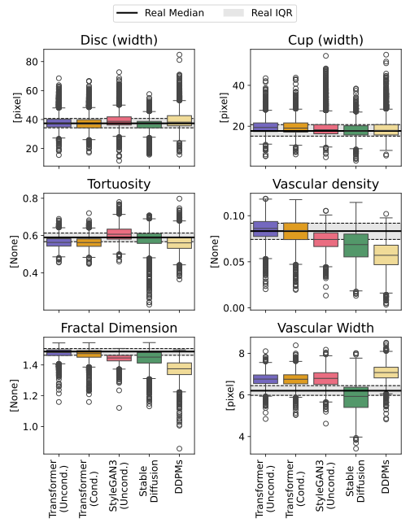
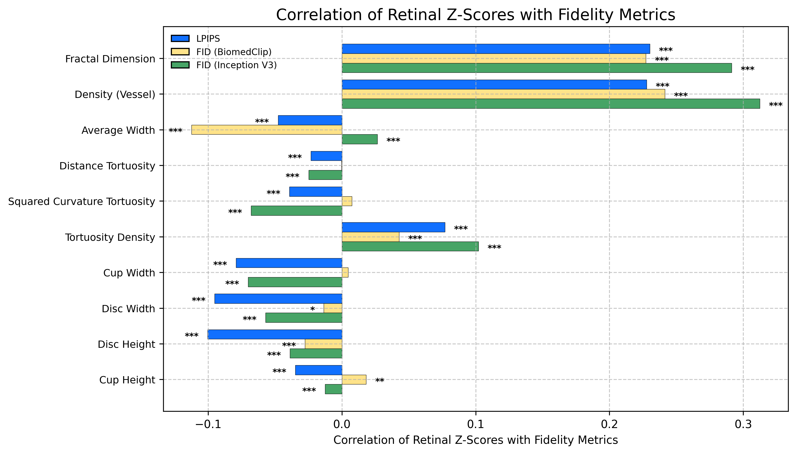

# Generative Artificial Networks Fail to Synthesize Morphologically-Correct Colour Fundus Imaging

This repository contains the code and analysis for our study:  
**“Generative Artificial Networks Fail to Synthesize Morphologically-Correct Colour Fundus Imaging.”**

Code related to the **validation strategy** and additional **Python scripts** will be added soon.

---

## 🔍 Main Findings

1. **Failure of generative models to preserve retinal morphology**  
   Across all common generative architectures — including *diffusion*, *latent diffusion*, *StyleGAN3*, and *transformer-based* models — we observe a consistent failure to synthesize colour fundus images that maintain **morphological integrity**, particularly of **retinal vasculature**.  
   *See Fig. 1.*

2. **Limitations of fidelity and perceptual metrics**  
   Widely used image quality metrics such as **FID** (Fréchet Inception Distance) and **LPIPS** (Learned Perceptual Image Patch Similarity) provide **limited or misleading insight** when applied to colour fundus imaging.  

   - In our analysis, convergence of FID and LPIPS is **only weakly correlated** with vascular tortuosity measures.  
   - More importantly, these metrics **encourage misalignment** in key morphological features — including **vessel width**, **optic disc**, and **optic cup** dimensions — as demonstrated by statistically significant **negative correlations** (see Fig. 2).

---

   
  <em>Figure 1. Feature misalignment in synthetic colour fundus images generated by different models.</em>

   
  <em>Figure 2. Correlation between perceptual metrics and morphological measures.</em>

---

More details on dataset preprocessing, metric computation, and validation methodology will be released in upcoming updates.

